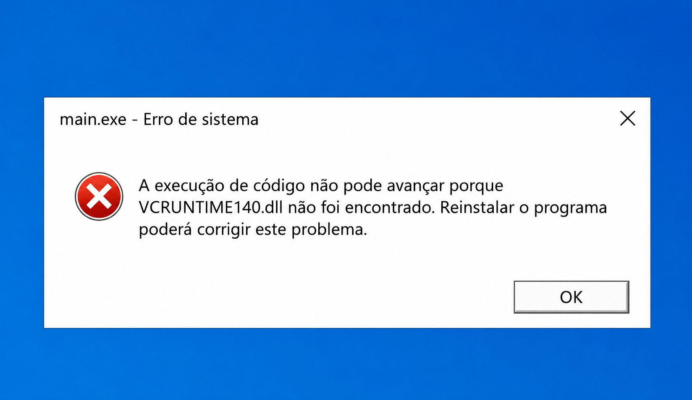

# Bem-vindo ao SiGRe-CTA!

Caso deseje testar o sistema, será necessário realizar o download da pasta build disponível em: https://drive.google.com/drive/folders/1ef6gQ7gKKhn4m_sBiJcTmDDnbEEZ9zBH?usp=sharing

## Tutorial de execução após a pasta build ser baixada:
1. Descompactar a pasta: botão direito em cima do arquivo --> extrair tudo
2. Acessar build --> build --> exe.win-amd64-3.11
3. Clicar 2 vezes no arquivo main ou main.exe (pode variar conforme o computador)

Caso, ao executar a main surja um erro semelhante a esse:

será necessário instalar o Visual C++ Redistributable, um programa oficial da Microsoft que já vem instalado por padrão em máquinas mais recentes, e que é necessário para executar diversas aplicações desktop.
Dentro da pasta exe.win-amd... existe um arquivo chamado vc_redist.x64 (emitido diretamente da página oficial da Microsoft). Basta clicar duas vezes e seguir a instalação, clicando sempre em "Próximo".

Feito isto, o SiGRe-CTA já deverá poder ser executado. Basta clicar novamente em main e seguir os passos a seguir (o sistema irá exibir um terminal por padrão (tela preta), não se preocupe).

## Tutorial básico de utilização do sistema:
1. Com o sistema aberto, clique em "Gerar Resoluções"
2. Será aberta a tela de criação. Preencha todos os dados do quadro verde do lado esquerdo (dados simulados)
3. No canto superior direito, clique no +. Surgirá uma barra de pesquisa, selecione um dos modelos. Dê preferência aos modelos mais simples para fins de praticidade (Afastamento de discente, Cancelamento de orientação e Troca de orientação, por exemplo)
4. Clique em "Carregar" e, em seguida, preencha os campos que irão surgir
5. Após preencher todos os dados, clique em "Gerar Resolução" e aguarde alguns segundos
5. Retorne à pasta exe.win-amd... no explorador de arquivos de seu computador e terá um diretório chamado "resolucoes". Acesse o diretório interno (ano da resolução criada) e verá os documentos gerados

**Observações importantes:**
* É possível que a interface fique um pouco distorcida a depender do computador. Esse ajuste será feito de acordo com a resolução dos computadores da secretaria quando o sistema estiver em produção
* Caso não tenha o LibreOffice instalado, será gerado na pasta de "resolucoes" apenas o arquivo .docx (sem sua versão em PDF)
* Em "Configurações avançadas" mantenha "Salvar no Google Drive" desmarcado. Este recurso funciona apenas para os usuários que tiverem o Google Drive Desktop instalado e configurado com a conta institucional do PPGCTA
* Foram feitos testes de execução em diferentes máquinas para garantir o funcionamento do sistema nesta fase de avaliação, no entanto, é possível que mesmo seguindo estes tutoriais, surjam especificidades que podem barrar a execução do software.
Isso ocorre, pois são necessárias várias dependências, e cada computador tem configurações distintas. Estarei à disposição para auxiliar nesses casos.

Qualquer dúvida quanto à instalação ou execução do sistema poderá ser direcionada a juan.bevilaqua703@academico.ufgd.edu.br, ou via WhatsApp.
